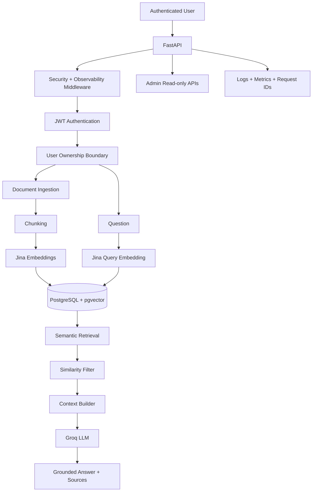

# AIA Business Knowledge Assistant

A production-minded, multi-user Retrieval-Augmented Generation system for small and medium businesses.

## Stable Release

**v1.1.0**

AIA Business Knowledge Assistant turns business documents into a secure, searchable knowledge system with grounded AI answers and source metadata. v1.1.0 also includes a minimal browser UI for the live portfolio demo.


## Web UI

The application root provides a minimal browser interface for:

- account registration and login
- document upload and automatic indexing
- document listing
- grounded question answering
- source citations

The public demo UI is intentionally lightweight and uses the existing FastAPI API.

## Architecture



## Highlights

- FastAPI backend
- PostgreSQL + pgvector
- Jina embeddings
- Groq grounded generation
- PDF/TXT/Markdown ingestion
- semantic search
- similarity thresholding
- safe no-context fallback
- source metadata
- conversation persistence
- Argon2 password hashing
- JWT authentication
- per-user resource isolation
- administrator visibility
- structured JSON logs
- request tracing
- provider retries and timeouts
- readiness checks
- runtime metrics
- rate limiting
- request-size limits
- MIME validation
- browser security headers
- CORS and trusted-host controls
- non-root Docker execution
- Alembic migration management

## Quick Start

Create `.env` from `.env.example` and configure:

```text
JINA_API_KEY
GROQ_API_KEY
JWT_SECRET_KEY
```

Then:

```powershell
docker compose up --build -d
docker compose exec app alembic stamp 0001
docker compose exec app pytest
```

Development Swagger:

```text
http://localhost:8000/docs
```

## Demo

Demo documents:

```text
demo_data/
```

Recommended file:

```text
demo_data/automation_services.txt
```

Ask:

```text
Can the company automate repetitive business tasks?
```

Then ask:

```text
What is the weather in Berlin today?
```

The second question should return a safe no-context response rather than inventing an answer.

## Operational Endpoints

```text
GET /health
GET /health/db
GET /health/providers
GET /ready
GET /release
```

Admin-only:

```text
GET /api/admin/stats
GET /api/admin/users
GET /api/admin/documents
GET /api/admin/conversations
GET /api/admin/metrics
```

## Validation

```powershell
docker compose exec app pytest
docker compose exec app python scripts/smoke_test.py
docker compose exec app alembic current
```

## Documentation

- `docs/architecture.md`
- `docs/architecture-diagram.md`
- `docs/api-examples.md`
- `docs/demo-script.md`
- `docs/deployment.md`
- `docs/github-publishing-checklist.md`
- `docs/observability.md`
- `docs/portfolio-story.md`
- `docs/production-checklist.md`
- `docs/release-notes-v1.0.0.md`
- `docs/security.md`
- `docs/security-hardening.md`

## Release History

- `v0.1.0` Foundation
- `v0.2.1` Document ingestion
- `v0.3.1` Jina embeddings + semantic retrieval
- `v0.4.0` Grounded RAG + Groq + citations
- `v0.5.0` Authentication + user ownership
- `v0.6.0` Admin workflows
- `v0.7.0` Observability + reliability
- `v0.8.0` Security + production hardening
- `v0.9.0` Release candidate
- `v1.0.0` Stable portfolio release
- `v1.1.0` Minimal live-demo web UI

## License

MIT
