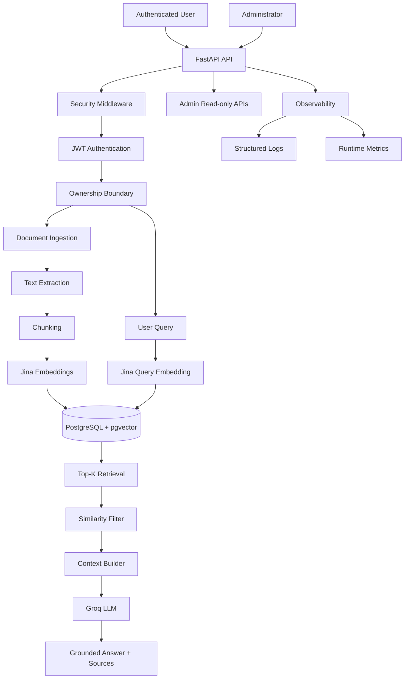

# Architecture Diagram

## Design Principles

- one application service
- explicit provider boundaries
- user-scoped data access
- deterministic source metadata
- graceful provider failure handling
- security controls before public deployment
